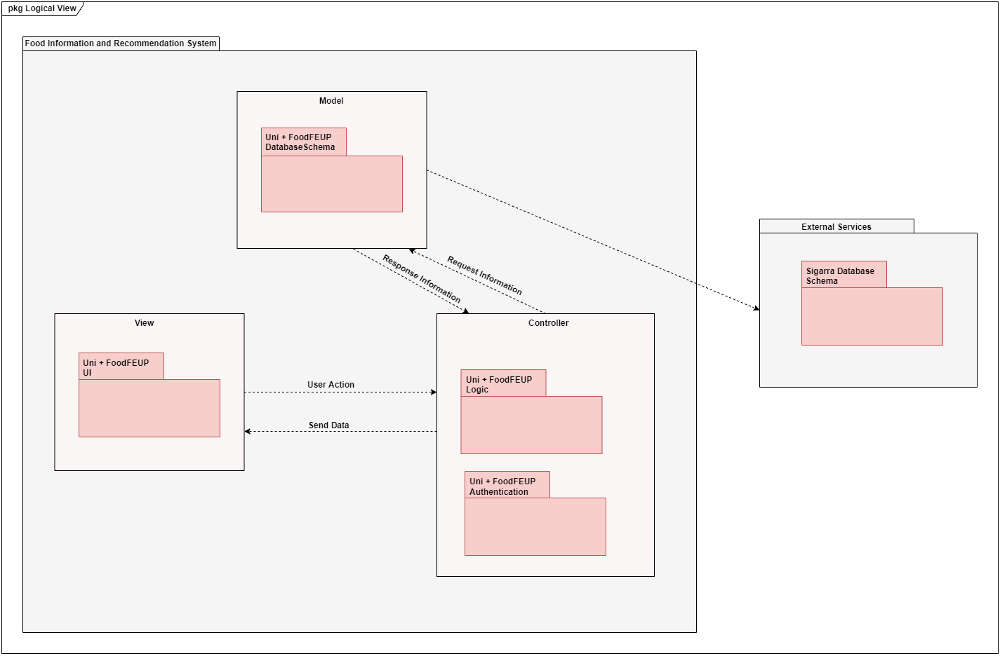
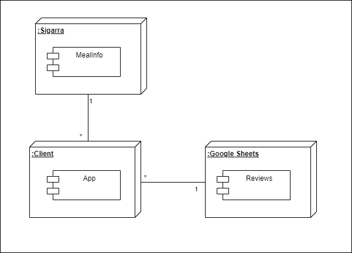

## Architecture and Design

In this section it will be explained both logical and physical architectures of the project as some key aspects of its design.

This project will use the Model-View-Controller design pattern, where the program is divided into three interconnected elements that focus on a functional GUI.

  

     
### Logical architecture

The purpose of this subsection is to document the high-level logical structure of the code (Logical View), using a UML diagram with logical packages, without the worry of allocating to components, processes or machines.

* `Uni + FoodFEUP UI`: responsible for how the user will interact
* `Uni + FoodFEUP Logic`: responsible for control and processing data
* `Uni + FoodFEUP Authentication`: user athentication (login, logout, register)
* `Uni + FoodFEUP Database Schema`: saves user feedback and sigarra informations
* `Uni + FoodFEUP Sigarra Database Schema`: data from sigarra

### Physical architecture

Only two entities are present on FEUP Food's physical architecture: the app itself, that interacts with the user, and the server containing the database where the information is stored.

Regarding the technologies used, the frontend will depend on Flutter (with the Dart programming language) and the backend on SQLite.

### Vertical prototype

To help on validating all the architectural, design and technological decisions made, we usually implement a vertical prototype, a thin vertical slice of the system.

In this subsection please describe which feature you have implemented, and how, together with a snapshot of the user interface, if applicable.

At this phase, instead of a complete user story, you can simply implement a feature that demonstrates thay you can use the technology, for example, show a screen with the app credits (name and authors).
