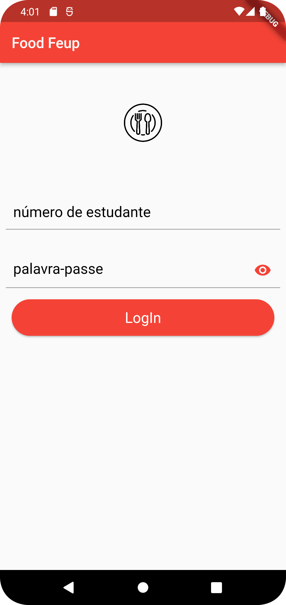

## Architecture and Design

In this section it will be explained both logical and physical architectures of the project as some key aspects of its design.

This project will use the Model-View-Controller design pattern, where the program is divided into three interconnected elements that focus on a functional GUI.

  

     
### Logical architecture

To document the high-level logical structure of the code (Logical View), we use a UML diagram with logical packages.

* `Uni + FoodFEUP UI`: responsible for how the user will interact
* `Uni + FoodFEUP Logic`: responsible for control and processing data
* `Uni + FoodFEUP Authentication`: user athentication (contains login, logout and register)
* `Uni + FoodFEUP Database Schema`: stores data such as user feedback and sigarra informations
* `Sigarra Database Schema`: data from sigarra

### Physical architecture

Only two entities are present on FEUP Food's physical architecture: the app itself, that interacts with the user, and the server containing the database where the information is stored.

Regarding the technologies used, the frontend will depend on Flutter (with the Dart programming language) and the backend on SQLite.

### Vertical prototype

<h4> Login </h4>

  

We started by design the login page using moqups and then implementing a similar design using flutter widgets.
The login page consists of a logo, two textformfields and a button.
For this initial version the login button interacts with an SQLite database which we have previously configured

In the next steps of the project we will implement login using SIGARRA credentials.
When the login is sucessful the app opens another page that only contains a button to go back.
