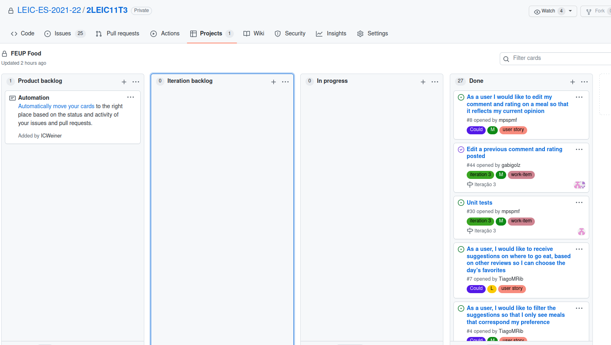

# Third Iteration Report

## Release management
[Release](https://github.com/LEIC-ES-2021-22/2LEIC11T3/releases/tag/v1)

## Retrospectives

### What went well?
- We managed again to fulfill our objectives in time, gaining some knowledge about flutter and dart and mainly how to properly utilize github and its features.

### What should we do differently? 
- We feel that nothing major should change.

### What still puzzles me?
- Flutter rebuild UI elements

## Iteration planning and Backlog management

  

